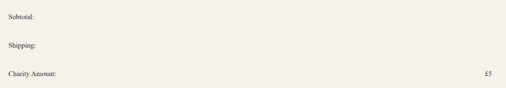
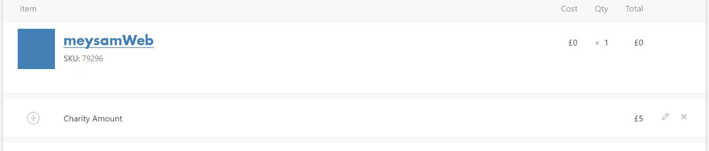
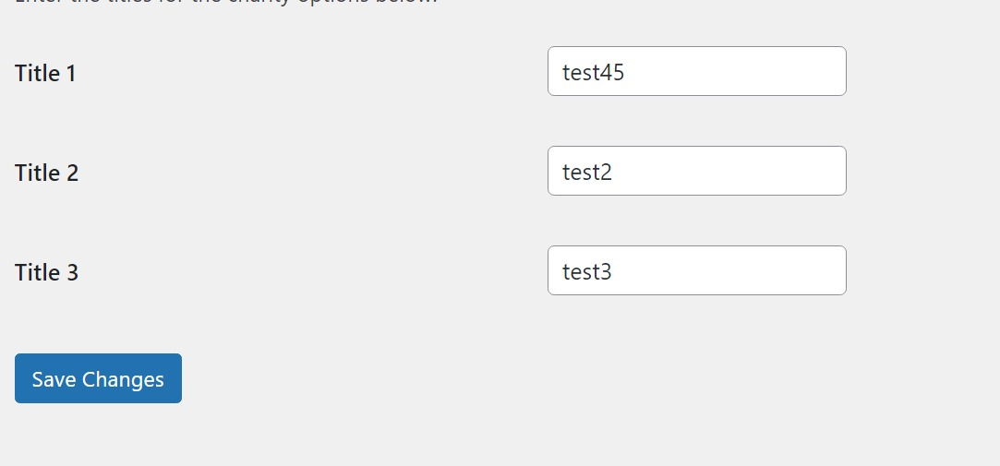
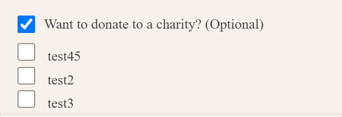

# My Charity Plugin v2.0.0

Allows users to add a charity amount to their cart and donate to a cause of their choice.

***A big update for the charity plugin :)***

Now you have a plugin that is a management menu in WordPress that is accessible only to the main admin.

### New features:
* Adding charity amount to order details

* Adding charity amount to order details in the WooCommerce admin panel

* Add dynamic text for charity text




### Directory Structure:
    my-custom-charity-plugin/
      ├── assets/
         └── css/
            ├── style.css
         └── js/
            ├── charity.js
      ├── includes/
         └── admin/
            ├── add-admin-menu.php
            ├── show-charity-amount-in-order-details.php
         └── front/
            ├── display-charity-amount-field.php
    ├── my-custom-charity-plugin.php


### Change Log

**Version 2.0.0**
````
- Plugin rewrite to modular
- Changes in the jQuery structure for better optimization and displaying the charity amount on the payment page
- Adding a management menu for the plugin for better access to change the displayed texts for charity
- Changing the plugin core to version 2
- Adding the display of the amount paid by users to the details of orders in WooCommerce (admin panel and customer orders)
- The ability to detect the currency used
- Compatible with WooCommerce 8.1.1
- Compatible with WordPress 6.3.1
- Run with PHP >= 7.4
````

**Version 1.0.2**
````
Fix: Bugs jQuery
````
**Version 1.0.0**

````
Init
````
